<!-- Minimalist Hero Section -->
<div align="center">
  
# **AZAIEZ ABDESSALEM**
### *Senior Full Stack Developer*

<sub>🎯 Java • Spring Boot • Angular • Microservices</sub>

---

</div>

<!-- Clean Professional Summary -->
<div align="center">
  
**3+ Years Experience** │ **15+ Projects** │ **60% Performance Boost** │ **Open to Work**

</div>

<!-- Elegant Separator -->
<div align="center">
  
```
┌─────────────────────────────────────────────────────────────────┐
│  Building scalable solutions with clean, efficient code         │
└─────────────────────────────────────────────────────────────────┘
```

</div>

<!-- Professional Experience Timeline -->
<div align="center">
  
</div>
<div align="center">
  
</div>


##  Professional Experience

<div align="center">
  
  
  
</div>

###  Current Role

<table>
<tr>
<td width="100%">

#### 🚀 **Senior Full Stack Developer** | [Cric Payz](https://cricpayz.com) 
**📅 Juil 2025 - Present** | **🏢 Real-Time Sports Betting Platform**

<div align="left">
  
  
  
</div>

**🎯 Key Achievements:**
- 🏗️ **Scalable Architecture** - Developed high-performance RESTful and WebSocket APIs for real-time betting platform
- ⚡ **Performance Excellence** - Built low-latency systems handling live odds management and bet processing
- 📱 **Real-Time Features** - Implemented live betting via WebSockets with event-driven architecture
- 🎥 **Media Integration** - Integrated M3U8 live streams using HLS.js for seamless in-app sports viewing
- 🚀 **Optimization** - Enhanced performance under high traffic using Redis caching and efficient database design

**💻 Tech Stack:** `Java` `Spring Boot` `WebSockets` `Angular` `HLS.js` `PostgreSQL` `Docker` `AWS` `JWT`

</td>
</tr>
</table>

###  Previous Experiences

<details>
<summary><b>🏢 INSY2S - Full Stack Developer (Août 2024 - Juil 2025)</b></summary>
<br>

<table>
<tr>
<td width="100%">

#### 🛡️ **Full Stack Developer** | [INSY2S](https://https://insy2s.com)
**📅 Août 2024 - Juil 2025** | **🏫 Event Registration & Session Management**

<div align="left">
  
  
  
</div>

**🎯 Key Achievements:**
- 🏗️ **Event Platform** - Designed and developed the architecture for event and registration management
- ⚡ **Scalable Architecture** - Built with Spring Boot & Spring Cloud microservices
- 🔒 **Secure Access** - Integrated Keycloak authentication & authorization
- 🎟️ **Smart Registration** - Implemented features for participant enrollment & session tracking
- 🎨 **User Experience** - Built an intuitive React interface for both participants and administrators
- 🎓 **Trainee Applications** - Integrated a training session application management system
- 🔗 **API Integration** - Designed and consumed APIs for seamless system communication
- 🧹 **Clean Code** - Wrote maintainable, well-documented, and testable code following best practices
- ✅ **Quality Assurance** - Delivered unit & integration tests to ensure reliability
- 🔄 **Code Reviews** - Led pull request validation and merge management on Gitea
- 🚀 **Continuous Deployment** - Deployed and maintained the application with regular updates & bug fixes
- 👨‍💻 **Collaboration** - Acted as reviewer for pull requests & merges, ensuring clean and reliable codebase

**💻 Tech Stack:** `Java` `Spring Boot` `Spring Cloud` `React` `TypeScript` `Micro Frontend` `Keycloak` `REST APIs` `Mockito` `Git`

</td>
</tr>
</table>

</details>

<details>
<summary><b>🏢 INSY2S - Full Stack Developer (Août 2023 - Juil 2024)</b></summary>
<br>

<table>
<tr>
<td width="100%">

#### 👥 **Full Stack Developer** | [INSY2S](https://https://insy2s.com)
**📅 Août 2023 - Juil 2024** | **🏢 Project-Based E-learning Platform**

<div align="left">
  
  
  
</div>

**🎯 Key Achievements:**
- 🏗️ **E-Learning Platform** - Designed and developed a project-based online learning platform using microservices architecture
- 🔒 **Authentication System** - Integrated Keycloak for secure and scalable user authentication and authorization
- ⚙️ **Backend Development** - Built backend services with Spring Boot microservices to meet the needs of learners and tutors
- 🔗 **API Integration** - Hands-on experience integrating RESTful APIs and web services for smooth system communication
- 🧹 **Clean Code** - Wrote maintainable, well-documented, and testable code following best practices
- ✅ **Unit Testing** - Implemented JUnit & Mockito tests to validate business features and ensure code quality
- 🔄 **Version Control** - Experienced with Git workflows, including merge management and code review processes
- 👨‍🏫 **Team Leadership** - Supervised and onboarded new interns, ensuring smooth integration into the project

**💻 Tech Stack:** `Java` `Spring Boot` `Spring Cloud` `Angular` `TypeScript` `Keycloak` `REST APIs` `Mockito` `Git`

</td>
</tr>
</table>

</details>

###  Professional Impact Summary

<div align="center">
  <table>
    <tr>
      <td align="center" width="25%">
        
        <br><sub><b>Average performance gains across projects</b></sub>
      </td>
      <td align="center" width="25%">
        
        <br><sub><b>System availability improvements</b></sub>
      </td>
      <td align="center" width="25%">
        
        <br><sub><b>Infrastructure cost optimizations</b></sub>
      </td>
      <td align="center" width="25%">
        
        <br><sub><b>API response time improvements</b></sub>
      </td>
    </tr>
  </table>
</div>


##  About Me

<table>
<tr>
<td width="50%">

```typescript
class AzaiezAbdessalem {
  name: string = "Azaiez Abdessalem";
  role: string = "Full Stack Developer";
  
  languages: string[] = [
    "Java", "TypeScript", "JavaScript", "SQL"
  ];
  
  frameworks: string[] = [
    "Spring Boot", "Angular", "Hibernate"
  ];
  
  databases: string[] = [
    "MySQL", "PostgreSQL", "MongoDB"
  ];
  
  architecture: string[] = [
    "Microservices", "REST APIs", "MVC"
  ];
  
  currentlyLearning() {
    return "Cloud Technologies & DevOps";
  }
  
  funFact() {
    return "I debug better with coffee! ☕";
  }
}
```

</td>
<td width="50%">

###  What I Do

🔸 **Full Stack Development** - Building end-to-end web applications  
🔸 **Backend Architecture** - Designing scalable Java/Spring Boot systems  
🔸 **Frontend Magic** - Creating responsive Angular and React interfaces  
🔸 **Database Design** - Optimizing queries and data structures  
🔸 **API Development** - RESTful services and microservices  
🔸 **DevOps Integration** - CI/CD pipelines and containerization  

###  Philosophy

*"Clean code is not written by following a set of rules. You don't become a software craftsman by learning a list of heuristics. Professionalism and craftsmanship come from values that drive disciplines."*

</td>
</tr>
</table>


##  Tech Stack Arsenal

<!-- Premium Tech Stack Showcase -->
<div align="center">
  
</div>

###  Backend Technologies

<div align="center">
  <table>
    <tr>
      <td align="center" width="120">
        
        <br><strong>Java 17+</strong>
        <br><sub>Core Language</sub>
      </td>
      <td align="center" width="120">
        
        <br><strong>Spring Boot</strong>
        <br><sub>Framework</sub>
      </td>
      <td align="center" width="120">
        
        <br><strong>Microservices</strong>
        <br><sub>Architecture</sub>
      </td>
      <td align="center" width="120">
        
        <br><strong>Hibernate</strong>
        <br><sub>ORM</sub>
      </td>
      <td align="center" width="120">
        
        <br><strong>Maven</strong>
        <br><sub>Build Tool</sub>
      </td>
    </tr>
  </table>
</div>

###  Frontend Technologies

<div align="center">
  <table>
    <tr>
      <td align="center" width="120">
        
        <br><strong>Angular 17+</strong>
        <br><sub>Framework</sub>
      </td>
      <td align="center" width="120">
        
        <br><strong>TypeScript</strong>
        <br><sub>Language</sub>
      </td>
      <td align="center" width="120">
        
        <br><strong>RxJS</strong>
        <br><sub>Reactive</sub>
      </td>
      <td align="center" width="120">
        
        <br><strong>HTML5</strong>
        <br><sub>Markup</sub>
      </td>
      <td align="center" width="120">
        
        <br><strong>CSS3</strong>
        <br><sub>Styling</sub>
      </td>
    </tr>
  </table>
</div>

###  Database & Storage

<div align="center">
  <table>
    <tr>
      <td align="center" width="150">
        
        <br><strong>PostgreSQL</strong>
        <br><sub>Primary DB</sub>
      </td>
      <td align="center" width="150">
        
        <br><strong>MySQL</strong>
        <br><sub>Relational</sub>
      </td>
      <td align="center" width="150">
        
        <br><strong>MongoDB</strong>
        <br><sub>NoSQL</sub>
      </td>
      <td align="center" width="150">
        
        <br><strong>Redis</strong>
        <br><sub>Caching</sub>
      </td>
    </tr>
  </table>
</div>

###  DevOps & Cloud

<div align="center">
  <table>
    <tr>
      <td align="center" width="120">
        
        <br><strong>Docker</strong>
        <br><sub>Containers</sub>
      </td>
      <td align="center" width="120">
        
        <br><strong>AWS</strong>
        <br><sub>Cloud</sub>
      </td>
      <td align="center" width="120">
        
        <br><strong>CI/CD</strong>
        <br><sub>Automation</sub>
      </td>
      <td align="center" width="120">
        
        <br><strong>Git</strong>
        <br><sub>Version Control</sub>
      </td>
      <td align="center" width="120">
        
        <br><strong>Linux</strong>
        <br><sub>OS</sub>
      </td>
    </tr>
  </table>
</div>

<!-- Animated Skills Icons Showcase -->
<div align="center">
  
  <br>
  
  <br>
  
</div>

<!-- Premium GitHub Activity Graph -->
<div align="center">
  
</div>

<!-- Professional Competency Radar -->
<div align="center">
  
  <h3>🎯 Professional Competency Matrix</h3>
  
</div>

<div align="center">
  <table>
    <tr>
      <td align="center">
        🔥 **Backend Development**<br>
        <progress value="95" max="100"></progress><br>
        <sub>Java, Spring Boot, Microservices</sub>
      </td>
      <td align="center">
        ✨ **Frontend Development**<br>
        <progress value="90" max="100"></progress><br>
        <sub>Angular, TypeScript, RxJS</sub>
      </td>
    </tr>
    <tr>
      <td align="center">
        🗄️ **Database Design**<br>
        <progress value="88" max="100"></progress><br>
        <sub>SQL, NoSQL, Optimization</sub>
      </td>
      <td align="center">
        🚀 **DevOps & Cloud**<br>
        <progress value="82" max="100"></progress><br>
        <sub>Docker, AWS, CI/CD</sub>
      </td>
    </tr>
  </table>
</div>

<div align="center">
  
</div>

##  What I'm Currently Working On

<div align="center">



</div>

```mermaid
graph LR
    A[📦 Enterprise Apps] --> B[🌐 Microservices]
    B --> C[☁️ Cloud Deploy]
    C --> D[🚀 Production]
    
    E[🎨 UI/UX Design] --> F[📱 Angular SPA]
    F --> G[🔄 Reactive UI]
    G --> D
    
    style A fill:#e1f5fe
    style B fill:#f3e5f5
    style C fill:#e8f5e8
    style D fill:#fff3e0
    style E fill:#fce4ec
    style F fill:#e0f2f1
    style G fill:#f1f8e9
```

- 🏗️ **Enterprise Applications** - Building scalable systems with **Spring Boot** & **Angular**
- 🌐 **API Architecture** - Designing RESTful services and microservices patterns
- 🔧 **DevOps Pipeline** - Implementing CI/CD with Docker and cloud deployment
- 📱 **Modern Frontend** - Creating responsive, accessible user experiences
- 🔒 **Security Focus** - JWT authentication, OAuth2, and secure coding practices

<div align="center">
  
</div>

##  Core Competencies & Skills

<div align="center">
  <table>
    <tr>
      <td align="center" width="20%">
        
        <br><sub><b>Java • Spring Boot • REST APIs</b></sub>
      </td>
      <td align="center" width="20%">
        
        <br><sub><b>Angular • TypeScript • RxJS</b></sub>
      </td>
      <td align="center" width="20%">
        
        <br><sub><b>Microservices • Event-Driven</b></sub>
      </td>
      <td align="center" width="20%">
        
        <br><sub><b>Optimization • Caching • Scaling</b></sub>
      </td>
      <td align="center" width="20%">
        
        <br><sub><b>Docker • CI/CD • AWS</b></sub>
      </td>
    </tr>
  </table>
</div>

###  Technical Proficiency Matrix

<table>
<tr>
<td width="50%">

#### 🎯 **Backend Excellence**
```java
@RestController
public class ExpertiseController {
    
    @Autowired
    private SkillService skillService;
    
    @GetMapping("/skills/backend")
    public ResponseEntity<List<Skill>> getBackendSkills() {
        return ResponseEntity.ok(
            Arrays.asList(
                new Skill("Java", "Advanced", 3),
                new Skill("Spring Boot", "Advanced", 3),
                new Skill("Microservices", "Advanced", 3),
                new Skill("WebSockets", "Advanced", 3),
                new Skill("JPA/Hibernate", "Advanced", 3)
            )
        );
    }
}
```

#### 🗄️ **Database Mastery**
- **Relational:** PostgreSQL, MySQL, Oracle
- **NoSQL:** MongoDB, Redis
- **Optimization:** Query tuning, indexing, caching
- **Migrations:** Flyway, Liquibase

</td>
<td width="50%">

#### 🎨 **Frontend Mastery**
```typescript
@Component({
  selector: 'app-expertise',
  template: `
    <div *ngFor="let skill of frontendSkills$ | async">
      <skill-badge [skill]="skill"></skill-badge>
    </div>
  `
})
export class ExpertiseComponent {
  frontendSkills$ = this.skillService.getSkills([
    { name: 'Angular', level: 'Advanced', years: 3 },
    { name: 'TypeScript', level: 'Advanced', years: 3 },
    { name: 'RxJS', level: 'Advanced', years: 3 },
    { name: 'NgRx', level: 'Advanced', years: 3 },
    { name: 'Angular Material', level: 'Advanced', years: 3 }
  ]);
}
```

#### 🚀 **Performance & Scalability**
- **Caching:** Redis, Caffeine, Browser caching
- **Load Testing:** JMeter, Artillery
- **Monitoring:** Application insights, logging
- **CDN:** Content delivery optimization

</td>
</tr>
</table>

###  Industry-Specific Experience

<div align="center">
  <table>
    <tr>
      <td align="center" width="33%">
        
        <br><sub><b>High-frequency trading, Live streaming, WebSocket APIs</b></sub>
      </td>
      <td align="center" width="33%">
        
        <br><sub><b>Parental controls, School safety, Privacy compliance</b></sub>
      </td>
      <td align="center" width="33%">
        
        <br><sub><b>Workflow automation, Employee management, Analytics</b></sub>
      </td>
    </tr>
  </table>
</div>

##  Continuous Learning & Development

<table>
<tr>
<td width="50%">

### ☁️ **Cloud & DevOps**
- **AWS Services** - EC2, S3, RDS, Lambda, ECS
- **Azure Platform** - App Services, Functions, AKS
- **Containerization** - Docker, Kubernetes, Helm
- **Infrastructure as Code** - Terraform, CloudFormation

### 🔄 **Advanced Architecture**
- **Reactive Programming** - Spring WebFlux, Project Reactor
- **Event-Driven Systems** - Apache Kafka, RabbitMQ
- **CQRS & Event Sourcing** - Axon Framework
- **Distributed Systems** - Service mesh, Circuit breakers

</td>
<td width="50%">

### 🧪 **Engineering Excellence**
- **Test-Driven Development** - JUnit, Mockito, Testcontainers
- **Clean Architecture** - Hexagonal, Onion patterns
- **Domain-Driven Design** - Bounded contexts, Aggregates
- **Security** - OAuth2, JWT, OWASP guidelines

### 🎨 **Modern Frontend**
- **Angular 17+** - Signals, Standalone components
- **State Management** - NgRx, Akita
- **Micro-frontends** - Module federation
- **PWA Development** - Service workers, Offline-first

</td>
</tr>
</table>

###  Recruiter Quick Facts

<div align="center">
  <table>
    <tr>
      <td align="center">
        
        <br><sub><b>Ready to start new projects</b></sub>
      </td>
      <td align="center">
        
        <br><sub><b>Open to hybrid/on-site</b></sub>
      </td>
      <td align="center">
        
        <br><sub><b>Bilingual communication</b></sub>
      </td>
      <td align="center">
        
        <br><sub><b>No sponsorship required</b></sub>
      </td>
    </tr>
  </table>
</div>

## 📈 GitHub Stats

<div align="center">
  
  
</div>

<div align="center">
  
</div>

## 🤝 Let's Connect!

<div align="center">
  <a href="https://linkedin.com/in/imed-zeiri" target="_blank">
    
  </a>
  <a href="mailto:your.email@example.com" target="_blank">
    
  </a>
  <a href="https://twitter.com/imed_zeiri" target="_blank">
    
  </a>
</div>

## 💡 Fun Facts

- ⚡ I love optimizing code performance and database queries
- 🎮 Gaming enthusiast and problem-solving addict
- ☕ Coffee-driven developer (debug better with caffeine!)
- 🌍 Always excited to collaborate on innovative projects

---

<!-- Premium Profile Analytics Section -->
<div align="center">
  
  <h2>📊 Profile Analytics & Engagement</h2>
  
</div>

<div align="center">
  <table>
    <tr>
      <td align="center">
        
      </td>
      <td align="center">
        
      </td>
      <td align="center">
        
      </td>
    </tr>
  </table>
</div>

<!-- Advanced GitHub Contribution Snake Animation -->
<div align="center">
  
  <h3>🐍 GitHub Contribution Snake</h3>
  
</div>

<div align="center">
  <picture>
    <source media="(prefers-color-scheme: dark)" srcset="https://raw.githubusercontent.com/ImedZeiri/ImedZeiri/output/github-contribution-grid-snake-dark.svg">
    <source media="(prefers-color-scheme: light)" srcset="https://raw.githubusercontent.com/ImedZeiri/ImedZeiri/output/github-contribution-grid-snake.svg">
    
  </picture>
</div>

<!-- Professional Quote Section -->
<div align="center">
  
  <br>
  
  <br>
  
</div>

<!-- Call to Action Section -->
<div align="center">
  
  <h2>🚀 Ready to Collaborate?</h2>
  
</div>

<div align="center">
  <table>
    <tr>
      <td align="center" width="33%">
        
        <h4>🔥 Open Source</h4>
        <p>Contributing to amazing projects</p>
      </td>
      <td align="center" width="33%">
        
        <h4>👼 Freelance</h4>
        <p>Available for exciting projects</p>
      </td>
      <td align="center" width="33%">
        
        <h4>🌟 Full-Time</h4>
        <p>Looking for new opportunities</p>
      </td>
    </tr>
  </table>
</div>

<!-- Premium Footer with Wave Animation -->
<div align="center">
  
</div>

<!-- Final Thank You Message -->
<div align="center">
  
  <br><br>
  <h1>🚀 Thank You for Visiting! 🚀</h1>
  <h3>🌟 Let's Build Something Amazing Together! 🌟</h3>
  <p><em>Ready to turn ideas into exceptional digital experiences</em></p>
  <br>
  
</div>

<!-- Dynamic Footer Animation -->
<div align="center">
  
</div>
